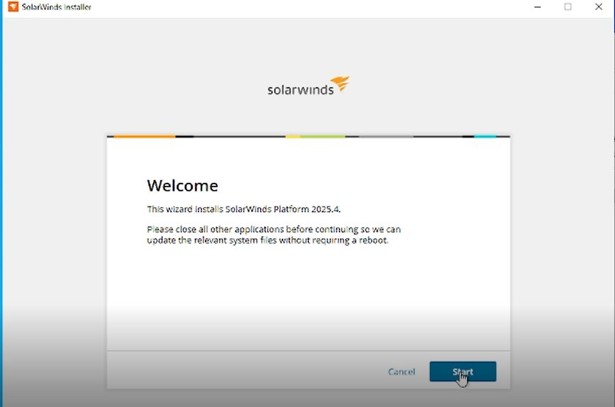

# Project SW-01 - SolarWinds Observability Self-Hosted Deployment

## Project Overview

This project documents the deployment of SolarWinds Observability Self-Hosted within the Enterprise Home Lab environment.

The monitoring platform provides centralized infrastructure visibility across servers, network devices, applications, and services.

This deployment introduces enterprise monitoring capabilities into the lab environment and provides a foundation for learning:

- Infrastructure monitoring
- Network performance monitoring
- Server monitoring
- Application monitoring
- Alert management
- Performance analysis
- Capacity planning
- Incident troubleshooting

The implementation simulates how enterprise organizations deploy monitoring platforms to maintain availability, performance, and operational visibility.

---

# Project Information

| Field | Details |
|---|---|
| Project ID | SW-01 |
| Project Name | SolarWinds Observability Self-Hosted Deployment |
| Status | Completed |
| Environment | Home Lab |
| Server Name | MON01 |
| IP Address | 10.1.20.20 |
| Platform | SolarWinds Observability Self-Hosted 2025.4.0 |
| Deployment Method | Offline Installer |
| Owner | Leonard Noumba |
| Deployment Date | 2026-06-23 |

---

# Business Justification

Modern enterprise environments require centralized monitoring to maintain service availability and quickly identify infrastructure issues.

The purpose of deploying SolarWinds Observability Self-Hosted is to provide:

- Real-time infrastructure visibility
- Network and server performance monitoring
- Alerting and event management
- Performance baseline creation
- Troubleshooting capabilities
- Enterprise monitoring experience

This deployment supports the development of skills required for:

- Network Engineering
- Systems Administration
- Observability Engineering

---

# Architecture Placement

```text
                    Internet
                       |
                   ISP Router
                       |
                    pfSense
                       |
                VLAN20-INFRA
                10.1.20.0/24
                       |
        --------------------------------
        |              |               |
       DC01           DB01           MON01
    10.1.20.10    10.1.20.21     10.1.20.20


MON01
 |
 |
SolarWinds Observability
 |
 |
Monitoring Targets:

- Windows Servers
- Network Devices
- pfSense
- Virtual Machines
- Applications
```

---

# Server Details

## Virtual Machine Configuration

| Parameter | Value |
|---|---|
| Hostname | MON01 |
| IP Address | 10.1.20.20 |
| Network | PG-INFRA |
| VLAN | VLAN20-INFRA |
| Operating System | Windows Server |
| Application | SolarWinds Observability Self-Hosted 2025.4.0 |

---

# Resource Allocation

| Resource | Value |
|---|---|
| vCPU | 4 |
| RAM | 8GB |
| Storage | 80GB |
| Network Adapter | VMXNET3 |

---

# Prerequisites

Before installation:

## Operating System

Verified:

- Windows Server installed
- Latest updates applied
- Static IP configured
- Hostname configured
- Network connectivity verified

---

## Network Requirements

Required:

```text
IP Address:
10.1.20.20

Subnet:
255.255.255.0

Gateway:
10.1.20.1

DNS:
Internal DNS Server
```

---

# Installation Procedure

## Step 1 - Download Installation Media

SolarWinds Observability Self-Hosted offline installer was downloaded.
**Download Link**: [SolarWinds installer](https://www.solarwinds.com/hybrid-cloud-observability/registration)

Installation media:

```text
SolarWinds Observability Self-Hosted Offline Installer
```

Deployment method:

```text
Manual Installation
```

---

# Step 2 - Launch Installer

Mounted:

```text
SolarWinds Hybrid Cloud Observability Offline Installer ISO file
```

Executed:

```text
SolarWinds Installer
```


Installation wizard started successfully.

---

# Step 3 - Installation Wizard Configuration

Started Installation


Selected Standard Platform and Clicked Next


Accepted:

- License agreement


---

# Step 4 - Installation Location

Configured installation directory and clicked Next.

Example:

```text
C:\Program Files (x86)\SolarWinds\
```

---

# Step 5 - System Validation

Installer performed:

- OS compatibility check
- Required service validation
- Dependency checks
- Network validation

All required checks completed successfully.


Clicked Install to start the Installation.


---

# Step 6 - Database Configuration

Post Installation, SolarWinds requires a database backend.

Connect the application to a DB backend via the SolarWinds Configuration Wizard which loads automatically after the installation is complete.

Configured:

```text
SQL Server Database
```

Database server:

```text
DB01
```


Database connectivity validated.


Completed the Wizard to create all three (3) required databases and started the DB Configuration


Waited for the Configuration Wizard to complete

---

# Step 7 - Complete Installation

DB Configuration completed successfully.


Verified SolarWinds services:

```text
Services.msc
```

Checked:

- SolarWinds services running


---

# Initial Configuration

## Access Web Console

Accessed:

```text
https://MON01.homelab.local/
```

or:

```text
https://10.1.20.20/
```

---

# Initial Setup Tasks

Completed:

- Initial login: Set default Admin account credentials


---

# Validation Testing

## Server Validation

| Test | Result |
|---|---|
| MON01 reachable | PASS |
| SolarWinds services running | PASS |
| Web console accessible | PASS |
| Database connectivity | PASS |

---

# Security Considerations

Implemented:

- Dedicated monitoring server
- Restricted network access
- Static IP addressing
- Database separation
- Controlled administrative access

---

# Future Enhancements

Planned:

- Add all infrastructure devices
- Configure SNMP monitoring
- Create dashboards
- Configure alert policies
- Integrate Syslog
- Integrate NetFlow
- Create executive dashboards

---

# Skills Demonstrated

This project demonstrates:

- Enterprise monitoring deployment
- Infrastructure observability
- Windows administration
- SQL integration
- Network monitoring
- Operational documentation

---

# Project Status

```text
COMPLETED
```

SolarWinds Observability Self-Hosted has been successfully deployed on MON01 and is ready for infrastructure monitoring expansion.

---