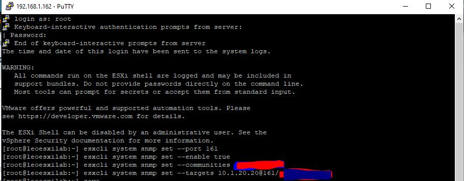
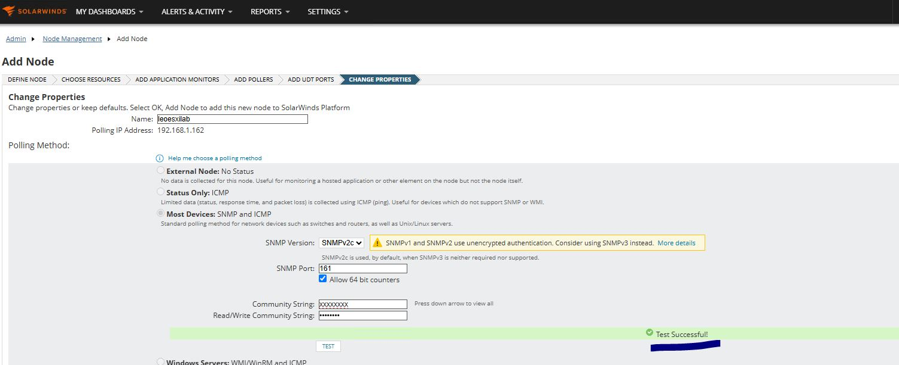
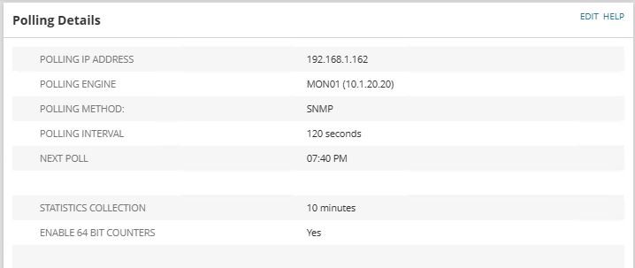

# VMware ESXi SNMP Configuration

## Objective

To configure SNMP on the VMware ESXi host to enable monitoring from the SolarWinds platform.

## Activities Performed

The following SNMP configurations were applied on the ESXi host through the ESXi Shell:

1. Configured the SNMP agent to listen on UDP port 161.

   ```shell
   esxcli system snmp set --port 161
   ```

2. Enabled the SNMP service on the ESXi host.

   ```shell
   esxcli system snmp set --enable true
   ```

3. Configured the SNMP community string.

   ```shell
   esxcli system snmp set --communities xxxxxxxx
   ```

4. Configured the SolarWinds server as the SNMP trap destination.

   ```shell
   esxcli system snmp set --targets 10.1.20.200@161/xxxxxxxx
   ```


## Outcome

SNMP was successfully configured on the VMware ESXi host, enabling the SolarWinds server to poll the host for monitoring and receive SNMP traps.




