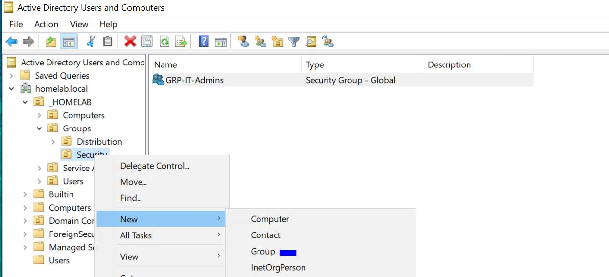
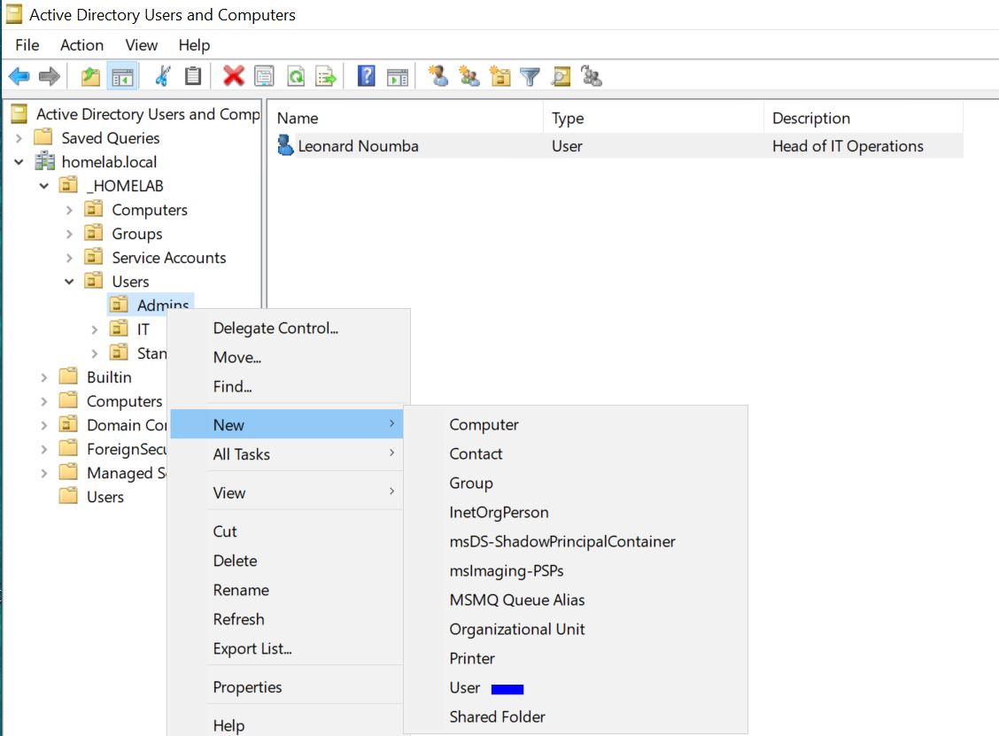
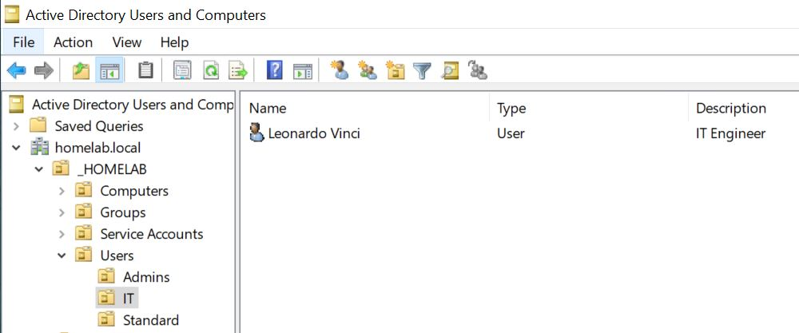

# Active Directory — User Management, Group Policy, DNS & Domain Join
## Project Documentation — PROJ-005

---

## Document Control

| Field | Value |
|---|---|
| Project ID | PROJ-005 |
| Title | Active Directory: User & Group Management, GPO, DNS Verification & Domain Join |
| Version | 1.0 |
| Author | Leonard Noumba |
| Parent Document | PROJ-004 (AD DS Installation & Configuration) |
| Environment | VMware ESXi 8.0 / Windows Server 2022 / pfSense Multi-VLAN Home Lab |
| Server | DC01 — 10.1.20.10 — VLAN10 MGMT |
| Domain | homelab.local / HOMELAB |
| Related Documents | PROJ-04 |

---

## Document Scope

This document is a continuation of **PROJ-04** and covers post-promotion Active Directory configuration from Phase 6 onwards. Each phase provides both **GUI (graphical)** and **PowerShell** methods where applicable, allowing practitioners to choose their preferred approach or use both for cross-validation.

**Prerequisites:** DC01 has been promoted to Domain Controller and is running. See PROJ-04 Phases 1–5 for server preparation, AD DS installation, promotion, DNS setup, and OU structure creation.

---

## Table of Contents

1. [Environment Reference](#1-environment-reference)
2. [Phase 6 — User and Group Management](#2-phase-6--user-and-group-management)
3. [Phase 7 — Group Policy Objects](#3-phase-7--group-policy-objects)
4. [Phase 8 — DNS Verification](#4-phase-8--dns-verification)
5. [Phase 9 — Join a Workstation to the Domain](#5-phase-9--join-a-workstation-to-the-domain)
6. [Verification & Testing](#6-verification--testing)
7. [Lessons Learned](#7-lessons-learned)
8. [Troubleshooting Reference](#8-troubleshooting-reference)

---

## 1. Environment Reference

| Component | Value |
|---|---|
| Domain Controller | DC01 |
| IP Address | 10.1.20.10 |
| Domain Name | homelab.local |
| NetBIOS Name | HOMELAB |
| VLAN20 (INFRA) | 10.1.20.0/24 |


### OU Path Reference

| OU | Distinguished Name |
|---|---|
| Root | `OU=_HOMELAB,DC=homelab,DC=local` |
| Admins | `OU=Admins,OU=Users,OU=_HOMELAB,DC=homelab,DC=local` |
| IT Users | `OU=IT,OU=Users,OU=_HOMELAB,DC=homelab,DC=local` |
| Standard Users | `OU=Standard,OU=Users,OU=_HOMELAB,DC=homelab,DC=local` |
| Security Groups | `OU=Security,OU=Groups,OU=_HOMELAB,DC=homelab,DC=local` |
| Distribution Groups | `OU=Distribution,OU=Groups,OU=_HOMELAB,DC=homelab,DC=local` |
| Workstations | `OU=Workstations,OU=Computers,OU=_HOMELAB,DC=homelab,DC=local` |
| Servers | `OU=Servers,OU=Computers,OU=_HOMELAB,DC=homelab,DC=local` |

---

## 2. Phase 6 — User and Group Management

### 2.1 Create Security Groups

Security groups control access to resources. All groups are created in the `Security` OU under `Groups`.

---

#### Method A — GUI (Active Directory Users and Computers)

1. Open **Server Manager → Tools → Active Directory Users and Computers**
2. Expand `homelab.local → _HOMELAB → Groups → Security`
3. Right-click the **Security** OU → **New → Group**
4. Fill in the **New Object — Group** dialog:



| Field | Value |
|---|---|
| Group name | GRP-IT-Admins |
| Group scope | Global |
| Group type | Security |

5. Click **OK**

7. Add a description to each group: right-click the group → **Properties → General tab → Description field**

---

#### Method B — PowerShell

```powershell
$securityOU = "OU=Security,OU=Groups,OU=_HOMELAB,DC=homelab,DC=local"

# IT Administrators group
New-ADGroup `
  -Name "GRP-IT-Admins" `
  -GroupScope Global `
  -GroupCategory Security `
  -Path $securityOU `
  -Description "IT Administrators with elevated privileges"

# IT Department users group
New-ADGroup `
  -Name "GRP-IT-Users" `
  -GroupScope Global `
  -GroupCategory Security `
  -Path $securityOU `
  -Description "IT Department standard users"

# Standard domain users group
New-ADGroup `
  -Name "GRP-Standard-Users" `
  -GroupScope Global `
  -GroupCategory Security `
  -Path $securityOU `
  -Description "Standard domain users"

# RDP access group
New-ADGroup `
  -Name "GRP-RDP-Access" `
  -GroupScope Global `
  -GroupCategory Security `
  -Path $securityOU `
  -Description "Users permitted to RDP to lab servers"
```

**Verify groups were created:**
```powershell
Get-ADGroup -Filter * -SearchBase $securityOU | Select-Object Name, GroupScope, GroupCategory
```

---

### 2.2 Create User Accounts

Three user accounts are created to represent different privilege tiers: admin, IT staff, and standard user.

---

#### Method A — GUI (Active Directory Users and Computers)

**Create the Admin Account (lnoumba):**

1. Expand `homelab.local → _HOMELAB → Users → Admins`
2. Right-click **Admins** OU → **New → User**
3. Fill in the **New Object — User** dialog:



| Field | Value |
|---|---|
| First name | Leonard |
| Last name | Noumba |
| Full name | Leonard Noumba |
| User logon name | lnoumba |
| User logon name (pre-Windows 2000) | lnoumba |

4. Click **Next**
5. Set password: `P@ssw0rd123!`
6. Configure password options:

| Option | Setting |
|---|---|
| User must change password at next logon | ✅ Checked |
| User cannot change password | ☐ Unchecked |
| Password never expires | ☐ Unchecked |
| Account is disabled | ☐ Unchecked |

7. Click **Next → Finish**
8. Right-click the new user → **Properties**
9. On the **General** tab, fill in:

| Field | Value |
|---|---|
| Description | IT Administrator |
| Office | Home Lab |

10. On the **Organisation** tab, fill in:

| Field | Value |
|---|---|
| Title | IT Administrator |
| Department | IT |

11. Click **OK**

**Repeated for IT lvinci** (in the `IT` OU):
**Repeated for Standard fqueen** (in the `Standard` OU):



---

#### Method B — PowerShell

```powershell
$adminOU    = "OU=Admins,OU=Users,OU=_HOMELAB,DC=homelab,DC=local"
$itOU       = "OU=IT,OU=Users,OU=_HOMELAB,DC=homelab,DC=local"
$standardOU = "OU=Standard,OU=Users,OU=_HOMELAB,DC=homelab,DC=local"

# Admin account
New-ADUser `
  -Name "Leonard Noumba" `
  -GivenName "Leonard" `
  -Surname "Noumba" `
  -SamAccountName "l.noumba" `
  -UserPrincipalName "l.noumba@homelab.local" `
  -Path $adminOU `
  -AccountPassword (ConvertTo-SecureString "P@ssw0rd123!" -AsPlainText -Force) `
  -PasswordNeverExpires $false `
  -ChangePasswordAtLogon $true `
  -Enabled $true `
  -Description "IT Administrator" `
  -Department "IT" `
  -Title "IT Administrator" `
  -Office "Home Lab"

# IT user
New-ADUser `
  -Name "IT User01" `
  -GivenName "IT" `
  -Surname "User01" `
  -SamAccountName "it.user01" `
  -UserPrincipalName "it.user01@homelab.local" `
  -Path $itOU `
  -AccountPassword (ConvertTo-SecureString "P@ssw0rd123!" -AsPlainText -Force) `
  -PasswordNeverExpires $false `
  -ChangePasswordAtLogon $true `
  -Enabled $true `
  -Description "IT Department User" `
  -Department "IT"

# Standard user
New-ADUser `
  -Name "Standard User01" `
  -GivenName "Standard" `
  -Surname "User01" `
  -SamAccountName "std.user01" `
  -UserPrincipalName "std.user01@homelab.local" `
  -Path $standardOU `
  -AccountPassword (ConvertTo-SecureString "P@ssw0rd123!" -AsPlainText -Force) `
  -PasswordNeverExpires $false `
  -ChangePasswordAtLogon $true `
  -Enabled $true `
  -Description "Standard Domain User" `
  -Department "Operations"
```

**Verify users were created:**
```powershell
Get-ADUser -Filter * -SearchBase "OU=Users,OU=_HOMELAB,DC=homelab,DC=local" `
  -Properties Department, Title | Select-Object Name, SamAccountName, Department, Title
```

---

### 2.3 Add Users to Groups

#### Method A — GUI

**Add lnoumba to GRP-IT-Admins:**

1. In **Active Directory Users and Computers**, navigate to `_HOMELAB → Groups → Security`
2. Double-click **GRP-IT-Admins** → click the **Members** tab
3. Click **Add**


4. Type `lnoumba` → click **Check Names** → **OK**
5. Click **Apply → OK**


**Add lnoumba to built-in Domain Admins:**

1. Navigate to `homelab.local → Builtin` (or `Users` container)
2. Double-click **Domain Admins** → **Members** tab → **Add**
3. Type `lnoumba` → **Check Names** → **OK → Apply → OK**

---

#### Method B — PowerShell

```powershell
# Admin user — IT Admins, Domain Admins, RDP Access
Add-ADGroupMember -Identity "GRP-IT-Admins"      -Members "l.noumba"
Add-ADGroupMember -Identity "Domain Admins"      -Members "l.noumba"
Add-ADGroupMember -Identity "GRP-RDP-Access"     -Members "l.noumba"

```

**Verify group memberships:**
```powershell
# Check GRP-IT-Admins members
Get-ADGroupMember -Identity "GRP-IT-Admins" | Select-Object Name, SamAccountName, ObjectClass

# Check GRP-RDP-Access members
Get-ADGroupMember -Identity "GRP-RDP-Access" | Select-Object Name, SamAccountName

# Check all groups a specific user belongs to
Get-ADPrincipalGroupMembership -Identity "l.noumba" | Select-Object Name
```

---

## 3. Phase 7 — Group Policy Objects

Group Policy Objects (GPOs) enforce security baselines and configuration standards across all domain-joined machines. Three GPOs are created in this phase.

| GPO Name | Linked OU | Purpose |
|---|---|---|
| GPO-Baseline-Security | `OU=_HOMELAB` | Security settings for all lab objects |
| GPO-Workstation-Config | `OU=Workstations` | Workstation-specific policy |
| GPO-Server-Config | `OU=Servers` | Server hardening policy |

---

### 3.1 Create GPO — Baseline Security

#### Method A — GUI

1. Open **Server Manager → Tools → Group Policy Management**
2. Expand **Forest: homelab.local → Domains → homelab.local**
3. Right-click **Group Policy Objects** → **New**


4. Name: `GPO-Baseline-Security` → click **OK**
5. Right-click `OU=_HOMELAB` → **Link an Existing GPO**
6. Select **GPO-Baseline-Security** → click **OK**

**Edit the GPO — Disable Guest Account:**

1. Right-click **GPO-Baseline-Security** → **Edit**
2. Navigate to:
```
Computer Configuration
  └── Policies
        └── Windows Settings
              └── Security Settings
                    └── Local Policies
                          └── Security Options
```
3. Double-click **Accounts: Guest account status**
4. Check **Define this policy setting** → select **Disabled** → **OK**


**Edit the GPO — Interactive Logon Warning Banner:**

Still in Security Options:

1. Double-click **Interactive logon: Message title for users attempting to log on**
2. Check **Define this policy setting**
3. Enter: `Authorised Access Only` → **OK**

4. Double-click **Interactive logon: Message text for users attempting to log on**
5. Check **Define this policy setting**
6. Enter: `You are accessing a DaVince Technologies information system.` → **OK**


---

#### Method B — PowerShell

```powershell
# Create and link the GPO
New-GPO -Name "GPO-Baseline-Security" `
  -Comment "Baseline security settings applied to all homelab objects"

New-GPLink -Name "GPO-Baseline-Security" `
  -Target "OU=_HOMELAB,DC=homelab,DC=local" `
  -LinkEnabled Yes

# Disable Guest account via GPO registry setting
Set-GPRegistryValue -Name "GPO-Baseline-Security" `
  -Key "HKLM\SYSTEM\CurrentControlSet\Control\Lsa" `
  -ValueName "LimitBlankPasswordUse" `
  -Type DWord `
  -Value 1

# Set logon warning banner title
Set-GPRegistryValue -Name "GPO-Baseline-Security" `
  -Key "HKLM\SOFTWARE\Microsoft\Windows\CurrentVersion\Policies\System" `
  -ValueName "legalnoticecaption" `
  -Type String `
  -Value "Authorised Access Only"

# Set logon warning banner text
Set-GPRegistryValue -Name "GPO-Baseline-Security" `
  -Key "HKLM\SOFTWARE\Microsoft\Windows\CurrentVersion\Policies\System" `
  -ValueName "legalnoticetext" `
  -Type String `
  -Value "This system is for authorised users only. All activity is monitored and logged."

```

> **Note:** Some security settings (e.g. Rename Administrator account) can only be configured via the GUI Group Policy Management Editor as they are secedit-based settings not directly accessible via `Set-GPRegistryValue`. Use Method A for those specific settings.

---

### 3.2 Create GPO — Workstation Configuration

#### Method A — GUI

1. In **Group Policy Management**, right-click **Group Policy Objects** → **New**
2. Name: `GPO-Workstation-Config` → **OK**
3. Right-click `OU=Workstations` under `_HOMELAB → Computers` → **Link an Existing GPO**
4. Select **GPO-Workstation-Config** → **OK**

**Edit — Screen Lock / Inactivity Timeout:**

1. Right-click **GPO-Workstation-Config** → **Edit**
2. Navigate to:
```
Computer Configuration
  └── Policies
        └── Windows Settings
              └── Security Settings
                    └── Local Policies
                          └── Security Options
```
3. Double-click **Interactive logon: Machine inactivity limit**
4. Check **Define this policy setting**
5. Enter `600` seconds (10 minutes) → **OK**


---

#### Method B — PowerShell

```powershell
# Create and link GPO
New-GPO -Name "GPO-Workstation-Config" `
  -Comment "Configuration and restrictions for workstation computers"

New-GPLink -Name "GPO-Workstation-Config" `
  -Target "OU=Workstations,OU=Computers,OU=_HOMELAB,DC=homelab,DC=local" `
  -LinkEnabled Yes

# Set machine inactivity lock (600 seconds = 10 minutes)
Set-GPRegistryValue -Name "GPO-Workstation-Config" `
  -Key "HKLM\SOFTWARE\Microsoft\Windows\CurrentVersion\Policies\System" `
  -ValueName "InactivityTimeoutSecs" `
  -Type DWord `
  -Value 600
```


### 3.4 Configure Password Policy (Default Domain Policy)

Password policy is set on the **Default Domain Policy**, it applies domain-wide to all user accounts.

#### Method A — GUI

1. In **Group Policy Management**, expand `homelab.local`
2. Right-click **Default Domain Policy** → **Edit**
3. Navigate to:
```
Computer Configuration
  └── Policies
        └── Windows Settings
              └── Security Settings
                    └── Account Policies
                          └── Password Policy
```
4. Configure each setting by double-clicking it:

| Setting | Recommended Value |
|---|---|
| Enforce password history | 10 passwords remembered |
| Maximum password age | 90 days |
| Minimum password age | 1 day |
| Minimum password length | 12 characters |
| Password must meet complexity requirements | Enabled |
| Store passwords using reversible encryption | Disabled |

5. Navigate to **Account Lockout Policy** (same parent path):

| Setting | Recommended Value |
|---|---|
| Account lockout duration | 30 minutes |
| Account lockout threshold | 5 invalid logon attempts |
| Reset account lockout counter after | 30 minutes |

6. Click **OK** on each setting → close the editor

---

#### Method B — PowerShell

```powershell
# Set password policy on Default Domain Policy
Set-ADDefaultDomainPasswordPolicy `
  -Identity "homelab.local" `
  -PasswordHistoryCount 10 `
  -MaxPasswordAge "90.00:00:00" `
  -MinPasswordAge "1.00:00:00" `
  -MinPasswordLength 12 `
  -ComplexityEnabled $true `
  -ReversibleEncryptionEnabled $false `
  -LockoutDuration "00:30:00" `
  -LockoutThreshold 5 `
  -LockoutObservationWindow "00:30:00"
```

**Verify the policy was applied:**
```powershell
Get-ADDefaultDomainPasswordPolicy -Identity "homelab.local"
```

---

### 3.5 Force GPO Update

After creating and configuring all GPOs, force an immediate update — without this, settings take effect only at the next automatic refresh interval (every 90 minutes by default).

#### Method A — GUI

1. In **Group Policy Management**, right-click `OU=_HOMELAB` → **Group Policy Update**
2. Click **Yes** to confirm — this triggers a remote `gpupdate /force` on all computers in scope
3. A results window shows the update status per computer

---

## 4. Phase 8 — DNS Verification

DNS is the foundation of Active Directory. All authentication (Kerberos), directory queries (LDAP), and domain join operations depend on correct DNS resolution. Verify DNS thoroughly before proceeding.

---

### 4.1 Verify Forward Lookup Zone

#### Method A — GUI

1. Open **Server Manager → Tools → DNS**
2. Expand `DC01 → Forward Lookup Zones → homelab.local`
3. Confirm the following records exist:

| Record Type | Name | Value |
|---|---|---|
| SOA | @ | DC01.homelab.local |
| NS | @ | DC01.homelab.local |
| A | DC01 | 10.1.20.10 |
| A | _msdcs | (multiple SRV/A records) |

---

#### Method B — PowerShell

```powershell
# List all DNS zones
Get-DnsServerZone

# List all records in the homelab.local zone
Get-DnsServerResourceRecord -ZoneName "homelab.local" | `
  Select-Object HostName, RecordType, RecordData | Sort-Object RecordType

# Confirm A record for DC01
Resolve-DnsName -Name "DC01.homelab.local" -Type A
```

Expected output:
```
Name                Type   TTL   Section    IPAddress
----                ----   ---   -------    ---------
DC01.homelab.local  A      1200  Answer     10.1.20.10
```

---

### 4.2 Verify Reverse Lookup Zone

#### Method A — GUI

1. In **DNS Manager**, expand `DC01 → Reverse Lookup Zones → 20.1.10.x Subnet`
2. Confirm a **PTR** record exists pointing `10` → `DC01.homelab.local`

If the reverse zone does not exist, create it:

1. Right-click **Reverse Lookup Zones** → **New Zone**
2. Select **Primary Zone** → **Next**
3. Select **To all DNS servers running on domain controllers in this domain** → **Next**
4. Select **IPv4 Reverse Lookup Zone** → **Next**
5. **Network ID:** enter `10.1.20` → **Next**
6. Accept defaults → **Finish**
7. Right-click the new zone → **New Pointer (PTR)**
8. Host IP: `10` | Host name: `DC01.homelab.local` → **OK**


---

### 4.3 Verify SRV Records (Critical for Domain Join & Authentication)

SRV records tell clients how to locate domain services (Kerberos, LDAP, Global Catalog). These are auto-created during promotion but must be verified.

#### Method A — GUI

1. In **DNS Manager**, expand `homelab.local → _msdcs → dc → _sites` and `_tcp`
2. Confirm the following SRV records exist under `_tcp`:

| Record | Purpose |
|---|---|
| `_ldap._tcp.homelab.local` | LDAP service locator |
| `_kerberos._tcp.homelab.local` | Kerberos authentication |
| `_gc._tcp.homelab.local` | Global Catalog |
| `_kpasswd._tcp.homelab.local` | Kerberos password change | 

---

#### Method B — PowerShell / Command Line

```powershell
# Verify LDAP SRV record
nslookup -type=SRV _ldap._tcp.homelab.local

# Verify Kerberos SRV record
nslookup -type=SRV _kerberos._tcp.homelab.local

# Verify Global Catalog SRV record
nslookup -type=SRV _gc._tcp.homelab.local
```

If SRV records are missing, restart the Netlogon service to force re-registration:
```powershell
Restart-Service netlogon
```

Then recheck after 60 seconds.

---

### 4.4 Run dcdiag (Full AD Health Check)

`dcdiag` is the authoritative tool for validating Domain Controller health. Run it after all configuration is complete.

#### Method A — GUI

`dcdiag` is a command-line tool only — no GUI equivalent.

---

#### Method B — PowerShell / Command Line

```powershell
# Full diagnostic run
dcdiag /v

# DNS-specific test only
dcdiag /test:DNS /v

# Test replication (more relevant when a second DC is added)
dcdiag /test:Replications

# Check replication summary
repadmin /replsummary

# Confirm all 5 FSMO roles are held by DC01
netdom query fsmo
```

**Expected `dcdiag /v` result (all tests should pass):**
```
......................... DC01 passed test Connectivity
......................... DC01 passed test Advertising
......................... DC01 passed test FrsEvent
......................... DC01 passed test DFSREvent
......................... DC01 passed test SysVolCheck
......................... DC01 passed test KccEvent
......................... DC01 passed test KnowledgeConsistencyChecker
......................... DC01 passed test MachineAccount
......................... DC01 passed test NCSecDesc
......................... DC01 passed test NetLogons
......................... DC01 passed test ObjectsReplicated
......................... DC01 passed test Replications
......................... DC01 passed test RidManager
......................... DC01 passed test Services
......................... DC01 passed test SystemLog
......................... DC01 passed test VerifyReferences
......................... DC01 passed test DNS
```

> A single-DC lab will show a warning for `Replications` as there is no replication partner. This is expected and can be resolved by deploying DC02 in a future phase.

---

## 5. Phase 9 — Join a Workstation to the Domain

This phase joins a client workstation to `homelab.local`, placing it in the correct OU and validating domain login.

---

### 5.1 Prepare the Workstation

Perform these steps **on the workstation**, not DC01.

#### Method A — GUI

1. Open **Settings → Network & Internet → Change adapter options**
2. Right-click the network adapter → **Properties**
3. Select **Internet Protocol Version 4 (TCP/IPv4)** → **Properties**
4. Set **Preferred DNS Server** to `10.1.20.10` (DC01)
5. Click **OK → Close**

---

### 5.2 Verify Connectivity to DC01 (Run on Workstation)

Before joining the domain, confirm the workstation can reach DC01 on all required ports:

```powershell
# Basic ICMP test
ping 10.1.20.10

# Confirm DNS resolution of the domain
nslookup homelab.local

# Test critical AD ports (requires Test-NetConnection / PowerShell 4+)
Test-NetConnection -ComputerName "10.1.20.10" -Port 53    # DNS
Test-NetConnection -ComputerName "10.1.20.10" -Port 88    # Kerberos
Test-NetConnection -ComputerName "10.1.20.10" -Port 389   # LDAP
Test-NetConnection -ComputerName "10.1.20.10" -Port 445   # SMB
Test-NetConnection -ComputerName "10.1.20.10" -Port 3268  # Global Catalog
```

> **Multi-VLAN note:** If the workstation is on a different VLAN (e.g. VLAN50 LAB), add pfSense firewall rules allowing the above ports from that VLAN to `10.1.20.10` before proceeding.

---

### 5.3 Join the Domain

#### Join Windows Server 2022

1. Right-click **This PC** → **Properties**
2. Click **Advanced system settings**
3. On the **Computer Name** tab, click **Change**


4. Under **Member of**, select **Domain**
5. Enter: `homelab.local`
6. Click **OK**


7. Enter domain credentials when prompted:

| Field | Value |
|---|---|
| Username | HOMELAB\Administrator |
| Password | (Administrator password) |


8. A dialog confirms: *"Welcome to the homelab.local domain"*


9. Click **OK → OK**
10. Click **Restart Now**

> **Important:** The GUI method places the computer object in the default `Computers` container, not the custom OU. We can move it after joining as we will demonstrate in Section 5.4.


---

#### Method B — PowerShell (run on workstation)

```powershell
# Join domain and place directly in the correct OU (preferred method)
Add-Computer `
  -DomainName "homelab.local" `
  -Credential (Get-Credential) `
  -OUPath "OU=Servers,OU=Computers,OU=_HOMELAB,DC=homelab,DC=local" `
  -NewName "MON01" `
  -Restart -Force
```

> When prompted for credentials, enter `HOMELAB\Administrator` and the Administrator password.
> The `-OUPath` parameter ensures the computer lands in the correct OU immediately — no manual move required.

---

### 5.4 Move Computer to Correct OU (GUI Join Only)

If you used the GUI method in 5.3, the computer object lands in the default `Computers` container. Move it to the correct OU:

#### Method A — GUI

1. On DC01, open **Active Directory Users and Computers**
2. Expand `homelab.local → Computers`
3. Right-click the workstation object → **Move**
4. Navigate to `_HOMELAB → Computers → Servers`
5. Click **OK**


---

#### Method B — PowerShell (run on DC01)

```powershell
# Move computer from default Computers container to the Workstations OU
Get-ADComputer -Identity "MON01" | Move-ADObject `
  -TargetPath "OU=Servers,OU=Computers,OU=_HOMELAB,DC=homelab,DC=local"
```

---

### 5.5 Verify Domain Join on DC01

After the server restarts, verify the join was successful from DC01:

#### Method A — GUI

1. Open **Active Directory Users and Computers**
2. Navigate to `_HOMELAB → Computers → servers`
3. Confirm `MON01` appears in the list
4. Right-click the object → **Properties** to confirm the **DNS name** and **Operating System** are populated


---

#### Method B — PowerShell (run on DC01)

```powershell
# Confirm computer object exists in AD
Get-ADComputer -Identity "MON01" -Properties DistinguishedName, OperatingSystem |
  Select-Object Name, DistinguishedName, OperatingSystem

# List all computers in the Workstations OU
Get-ADComputer -Filter * `
  -SearchBase "OU=Servers,OU=Computers,OU=_HOMELAB,DC=homelab,DC=local" |
  Select-Object Name, DistinguishedName
```

---

### 5.6 Test Domain Login on Workstation

After the workstation restarts:

1. At the Windows login screen, click **Other user**
2. Enter domain credentials:

| Field | Value |
|---|---|
| Username | HOMELAB\lnoumba |
| Password | (set password) |

3. Confirm login is successful
4. Open **Command Prompt** and verify:

```cmd
# Confirm the machine is domain-joined
echo %USERDOMAIN%

# Confirm the currently logged-in user
whoami

# Confirm GPOs are applying correctly
gpresult /r
```

Expected output:
```
USERDOMAIN = HOMELAB
whoami     = homelab\lnoumba
```

---

## 6. Verification & Testing

Run all checks below from DC01 after completing all phases. All items should pass before considering the deployment complete.

| # | Test | Command / Location | Expected Result |
|---|---|---|---|
| 1 | DC01 A record resolves | `Resolve-DnsName DC01.homelab.local` | Returns `10.1.20.10` |
| 2 | Reverse lookup | `Resolve-DnsName 10.1.20.10` | Returns `DC01.homelab.local` |
| 3 | LDAP SRV record | `nslookup -type=SRV _ldap._tcp.homelab.local` | Returns DC01 record |
| 4 | Kerberos SRV record | `nslookup -type=SRV _kerberos._tcp.homelab.local` | Returns DC01 record |
| 5 | AD DS full health | `dcdiag /v` | All tests pass |
| 6 | FSMO roles | `netdom query fsmo` | All 5 roles on DC01 |
| 7 | Security groups exist | `Get-ADGroup -Filter *` | All 4 groups visible |
| 8 | User accounts exist | `Get-ADUser -Filter *` | All 3 users visible |
| 9 | Group memberships | `Get-ADGroupMember "GRP-IT-Admins"` | lnoumba listed |
| 10 | GPOs exist and linked | `Get-GPO -All` | All 3 GPOs listed |
| 11 | GPO applied on DC01 | `gpresult /r` | GPOs listed as applied |
| 12 | Password policy active | `Get-ADDefaultDomainPasswordPolicy` | Matches configured values |
| 13 | Workstation joined domain | ADUC → Computers → Workstations | WORKSTATION01 visible |
| 14 | Domain login | Login as `HOMELAB\lnoumba` on workstation | Successful |
| 15 | GPO on workstation | `gpresult /r` on workstation | Baseline GPO applied |
| 16 | Logon banner appears | Restart workstation and observe login screen | Banner displays |

---

## 7. Lessons Learned

### 7.1 Technical

- **GUI group creation does not set the description field by default.** Always open Properties after creation and populate the Description field — this is standard practice in enterprise environments and critical for auditability.
- **PowerShell `-OUPath` during domain join eliminates a manual remediation step.** Computer objects placed in the default `Computers` container do not receive custom GPO policies. The PowerShell method is always preferred for controlled OU placement.
- **SRV records are automatically registered by the Netlogon service.** If they are missing, a Netlogon service restart resolves it in most cases — this is faster than manually creating SRV records.
- **Password policy set via `Set-ADDefaultDomainPasswordPolicy` applies to all domain users.** Fine-grained Password Policies (PSOs) are required if different password rules are needed per user group (e.g., stricter rules for admin accounts) — this is a recommended next step.
- **`dcdiag /v` is the single most useful post-deployment validation tool.** It covers connectivity, SRV records, replication, FSMO roles, and SYSVOL — running it after any major AD change should be standard practice.
- **Multi-VLAN lab environments require pfSense firewall rules for domain join.** Missing rules on inter-VLAN traffic silently block Kerberos and LDAP, making the domain appear unreachable even when DNS is correct.

---

## 8. Troubleshooting Reference

| Symptom | Likely Cause | Resolution |
|---|---|---|
| User cannot log in after domain join | Wrong username format | Use `HOMELAB\username`, not just `username` |
| GPO not applying to workstation | Computer in wrong OU | Move to correct OU via ADUC or `Move-ADObject` |
| GPO not applying after linking | Policy not refreshed | Run `gpupdate /force` on the target machine |
| Workstation cannot find domain | DNS not pointing to DC01 | Set DNS to `10.1.20.10` on workstation NIC |
| Domain join fails — timeout | Firewall blocking AD ports | Add pfSense rule allowing ports 53, 88, 389, 445, 3268 from workstation VLAN to VLAN10 |
| Domain join fails — credentials rejected | Wrong credential format | Use `HOMELAB\Administrator`, not `homelab.local\Administrator` |
| SRV records missing | Netlogon not registered them | Run `Restart-Service netlogon` on DC01 |
| `dcdiag` fails replication test | No second DC | Expected on single-DC lab — deploy DC02 to resolve |
| Logon banner not appearing | GPO not applied yet | Run `gpupdate /force`, then retest after reboot |
| Password change rejected | Complexity policy active | Use 12+ characters with upper, lower, number, symbol |
| User locked out | Exceeded logon threshold (5 attempts) | Unlock via `Unlock-ADAccount -Identity username` |
| Computer object in wrong OU | GUI join used without OUPath | Move via `Move-ADObject` or ADUC drag-and-drop |
| `nslookup homelab.local` fails on workstation | DNS not set to DC01 | Set preferred DNS to `10.1.20.10` |

---

## References

- Microsoft Docs — Active Directory Users and Computers: https://docs.microsoft.com/en-us/windows-server/identity/ad-ds/
- Microsoft Docs — Group Policy Management: https://docs.microsoft.com/en-us/previous-versions/windows/it-pro/windows-server-2012-r2-and-2012/
- Microsoft Docs — Active Directory PowerShell Module: https://docs.microsoft.com/en-us/powershell/module/activedirectory/
- PROJ-04 — Active Directory DS Installation & Configuration
