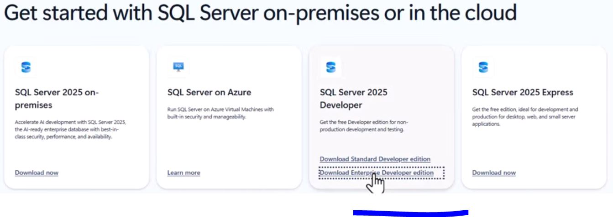
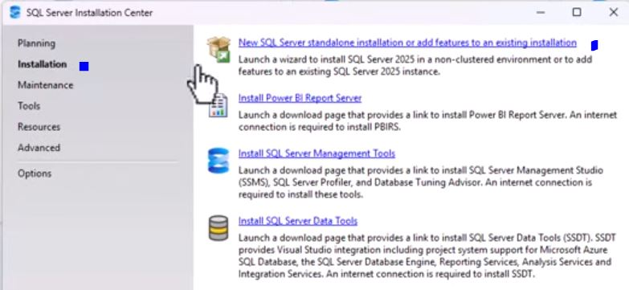
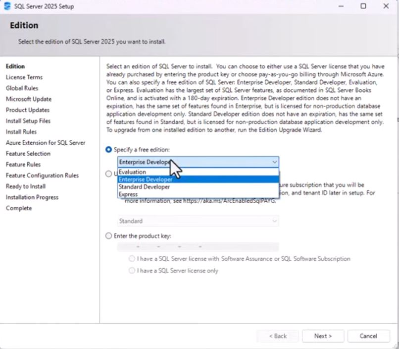

# HL-SRV-003 — MS SQL Server 2025 Developer Edition Deployment

| Field         | Detail                              |
|---------------|-------------------------------------|
| **Doc ID**    | DB01                          |
| **Version**   | 1.0                                 |
| **Date**      | 2026-06-22                          |
| **Author**    | Leonard Noumba                      |
| **Lab**       | Home Lab       |
| **Status**    | Deployed ✅                         |

---

## 1. Overview

This document records the deployment of **Microsoft SQL Server 2025 Developer Edition** within our home lab environment. The instance is hosted on a dedicated Windows Server virtual machine running under VMware ESXi 8.0 and is intended for development, testing, and lab documentation purposes. SQL Server Developer Edition is licensed for non-production use only.

---

## 2. Environment Summary

| Parameter              | Value                                      |
|------------------------|--------------------------------------------|
| **Hypervisor**         | VMware ESXi 8.0                            |
| **Physical Host**      | HP EliteDesk 800 G4                        |
| **VM Name**            | DB01                                       |
| **Guest OS**           | Windows Server 2022 (Standard)             |
| **VLAN**               | VLAN20 — Server Network                    |
| **IP Address**         | 10.1.20.21 *(assign static)*               |
| **SQL Server Edition** | Microsoft SQL Server 2025 Developer        |
| **Instance Type**      | Default Instance (MSSQLSERVER)             |
| **Authentication**     | Windows Authentication + SQL Auth (Mixed)  |

---

## 3. Prerequisites

Before beginning the installation the following were confirmed:

- [x] Windows Server VM provisioned and domain-joined to `homelab.local`
- [x] Static IP assigned within VLAN20 subnet
- [x] Windows Updates applied
- [x] .NET Framework 4.8 present (required by SQL Server setup)
- [x] Sufficient disk space — SQL Server 2025 requires **~6 GB** minimum; data/log volumes provisioned separately
- [x] SQL Server 2025 Developer Edition ISO/installer downloaded from the Microsoft Evaluation Center

---

## 4. Installation Steps

### 4.1 Download and Run Installer

1. Downloaded the MS SQL Installer from [Microsoft website](https://www.microsoft.com/en-us/sql-server/).


2. Ran the downloaded installer.
3. Selected the Installation type.


4. Selected the media download location and clicked install


5. Wait for the download to complete.


### 4.2 SQL Server Installation Center

1. Select **Installation** from the left panel.
2. Click **New SQL Server stand-alone installation or add features to an existing installation**.


### 4.3 Product Key

- Select **Standard Developer** from the free edition dropdown.
- Click **Next**.


### 4.4 License Terms

- Accept the license agreement.
- Click **Next**.


### 4.5 Feature Selection

Selected features:

| Feature                         | Purpose                              |
|---------------------------------|--------------------------------------|
| Database Engine Services        | Core SQL Server engine               |
| SQL Server Replication          | Replication support (optional)       |
| Full-Text and Semantic Search   | Full-text indexing (optional)        |


### 4.6 Instance Configuration

| Setting          | Value             |
|------------------|-------------------|
| Instance Type    | Default Instance  |
| Instance Name    | MSSQLSERVER       |
| Instance ID      | MSSQLSERVER       |

### 4.7 Server Configuration — Service Accounts

| Service                    | Account                  | Startup Type |
|----------------------------|--------------------------|--------------|
| SQL Server Agent           | NT Service\SQLSERVERAGENT | Manual       |
| SQL Server Database Engine | NT Service\MSSQLSERVER    | Automatic    |
| SQL Server Browser         | NT AUTHORITY\LOCAL SERVICE | Disabled    |

> SQL Server Browser was disabled as only a default instance is deployed. Enable if named instances are added later.

### 4.8 Database Engine Configuration

- **Authentication Mode:** Mixed Mode (Windows Authentication + SQL Server Authentication)
- **SA Password:** *(strong password set — stored in lab password manager)*
- **SQL Server Administrators:** Added `Homelab\Administrator` and the domain admin account

**Data Directories:**

| Directory Type | Path                         |
|----------------|------------------------------|
| Data root      | `C:\Program Files\Microsoft SQL Server` |
| User DB data   | `D:\SQLData`                 |
| User DB logs   | `L:\SQLLogs`                 |
| Backup         | `E:\SQLBackups`              |

> Separating data, log, and backup volumes onto distinct virtual disks is a best practice that improves I/O performance and simplifies recovery operations.

### 4.9 Ready to Install

- Reviewed the configuration summary.
- Clicked **Install**.


- Installation completed with no errors.

---

## 5. Post-Installation Configuration

### 5.1 Install SQL Server Management Studio (SSMS)

1. Download the latest SSMS installer from: `https://aka.ms/ssmsfullsetup`
2. Run the installer on DB01.
3. Complete the wizard with default settings.
4. Launch SSMS and connect to `localhost` using Windows Authentication to verify the engine is running.

### 5.2 Enable TCP/IP Protocol

By default the TCP/IP protocol may be disabled.

1. Open **SQL Server Configuration Manager**.
2. Navigate to **SQL Server Network Configuration → Protocols for MSSQLSERVER**.
3. Right-click **TCP/IP** → **Enable**.
4. Under TCP/IP Properties → **IP Addresses** tab, set **TCP Port** to `1433` on IPAll.
5. Restart the SQL Server service.

### 5.3 Windows Firewall Rule

```powershell
New-NetFirewallRule `
  -DisplayName "SQL Server Default Instance" `
  -Direction Inbound `
  -Protocol TCP `
  -LocalPort 1433 `
  -Action Allow `
  -Profile Domain,Private
```
---

## 6. SQL Server Agent

SQL Server Agent was set to **Manual** startup during installation. To enable scheduled jobs:

1. Open SSMS → Object Explorer → **SQL Server Agent**.
2. Right-click → **Start**.
3. To set it to start automatically:

```powershell
Set-Service -Name SQLSERVERAGENT -StartupType Automatic
Start-Service -Name SQLSERVERAGENT
```

---

## 7. Backup Strategy (Lab Baseline)

| Backup Type | Frequency | Destination      |
|-------------|-----------|------------------|
| Full        | Weekly    | `E:\SQLBackups`  |
| Differential| Daily     | `E:\SQLBackups`  |
| Log         | Every 4 h | `E:\SQLBackups`  |

---

## 8. Known Considerations

| Item | Note |
|------|------|
| Developer Edition license | Non-production use only. Not licensed for workloads serving external users. |
| SA account | SA login is enabled (Mixed Mode). Ensure a strong password is set and consider disabling SA after a dedicated SQL login is created. |
| SSMS version | Always install the latest SSMS version; it is released independently of the SQL Server engine. |

---

*Leonard Noumba Home Lab — Internal Documentation*
*GitHub: github.com/Noumba*
