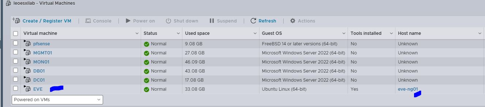
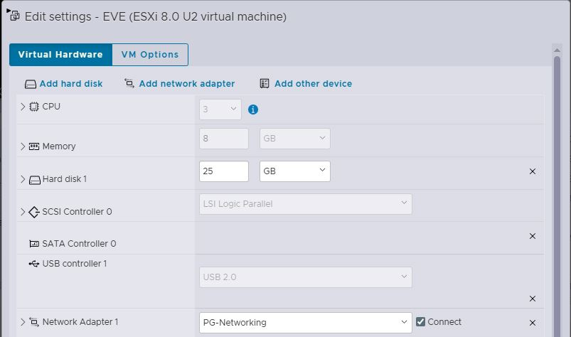
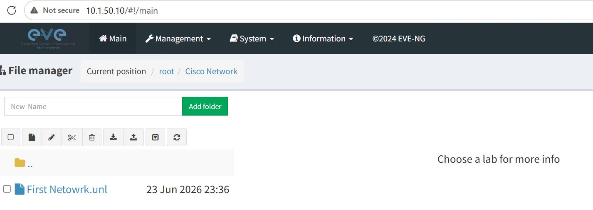
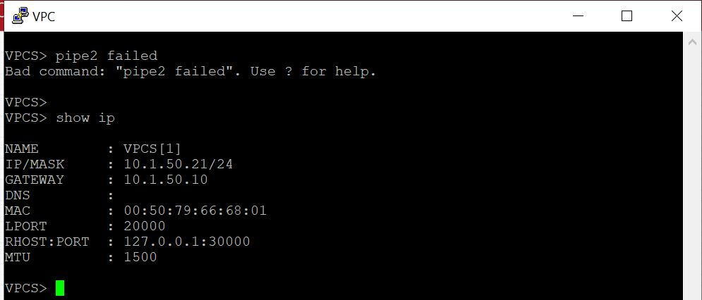

# Project 08 - EVE-NG Network Simulation Lab Deployment

## Project Overview

This project documents the deployment and initial configuration of **EVE-NG (Emulated Virtual Environment Next Generation)** within the Enterprise Home Lab environment.

EVE-NG was deployed as a network emulator to create realistic enterprise network scenarios, allowing testing and validation of:

- Routing and switching concepts
- VLAN segmentation
- Network device configurations
- Firewall and security designs
- Monitoring integrations
- Network automation workflows

This implementation provides a controlled environment to simulate enterprise networks before deploying changes into production environments.

---

# Project Information

| Parameter | Value |
|---|---|
| Project ID | PROJ-008 |
| Project Name | EVE-NG Network Simulation Platform |
| Status | Completed |
| Environment | Home Lab |
| Platform | VMware ESXi |
| Deployment Type | Virtual Machine |
| Owner | Leonard Noumba |
| Date | 2026-06-24 |

---

# Project Objectives

The objectives of this deployment are:

- Deploy EVE-NG on VMware ESXi
- Integrate EVE-NG into the existing lab network
- Validate communication between simulated devices and existing infrastructure
- Build a foundation for CCNA/CCNP enterprise networking labs
- Prepare environment for firewall, routing, switching, and monitoring simulations

---

# Architecture Overview

The EVE-NG deployment follows an enterprise-style network segmentation model.

```text
                         Internet
                            |
                        ISP Router
                            |
                         pfSense
                    Firewall / Router
                            |
        ----------------------------------------
        |                                      |
    VLAN20-INFRA                           VLAN50-LAB
    10.1.20.0/24                           10.1.50.0/24
        |                                      |
        |                                      |
     MON01                                  EVE01
 10.1.20.20                             10.1.50.10
 SolarWinds                                EVE-NG
                                                |
                                                |
                                     ----------------------
                                     |                    |
                                   VPC1                 VPC2
                               10.1.50.x            10.1.50.x
```

---

# Environment Details

## VMware ESXi

| Component | Details |
|-|-|
| Hypervisor | VMware ESXi |
| Network Platform | Virtual Switches / Port Groups |
| EVE Network | PG-Network |
| VLAN | VLAN50 |

---

# EVE-NG Server Details

| Parameter | Value |
|-|-|
| Hostname | EVE-NG01 |
| Platform | EVE-NG Community Edition |
| IP Address | 10.1.50.10 |
| Subnet Mask | 255.255.255.0 |
| Gateway | 10.1.50.1 |
| Port Group | PG-Network |
| VLAN ID | 50 |

---

# VM Deployment Configuration

The EVE-NG virtual machine was deployed on VMware ESXi.



## Virtual Hardware

| Resource | Allocation |
|-|-|
| CPU | 3 vCPU |
| Memory | 8 GB RAM |
| Storage | 25 GB Thin Provision |
| Network Adapter | VMXNET3 |



---

# VMware Configuration

## Port Group

Created:

```
PG-LAB
```

Assigned:

```
VLAN ID: 50
```

Network:

```
10.1.50.0/24
```

Gateway:

```
10.1.50.1
```

Purpose:

Provides connectivity between EVE-NG and the existing lab infrastructure.

---

# Network Integration

EVE-NG was connected to the LAB VLAN through pfSense.

Traffic flow:

```text
EVE-NG Device
       |
       |
VLAN50-Network
       |
       |
pfSense
       |
       |
Other VLANs
       |
       |
MON01 / Servers / Internet
```

pfSense provides:

- Layer 3 routing
- Firewall policy enforcement
- Internet access
- Network segmentation

---

# EVE-NG Initial Setup

## Step 1 - Download the EVE-NG OVA

1. On a machine with internet access, go to: [https://www.eve-ng.net/index.php/downloads/](https://www.eve-ng.net/index.php/downloads/)
2. Download the **EVE-NG Community Edition iso**
3. Transfer the `.iso` file to a location accessible from the ESXi host

---

### Import the OVA into ESXi

1. Log into the **ESXi Host Client** (`https://<ESXi IP>`)
2. In the left pane, click **Virtual Machines**
3. Click **Create / Register VM**
4. Select **Create a new virtual machine** → click **Next**
5. **Name:** `EVE-NG`
6. **Select Storage:** choose your datastore → click **Next**
7. Click **Choose Files** → select the downloaded `.iso` file → click **Next**
8. **Network Mappings:** map the first network adapter to **PG-LAB (VLAN50)** → click **Next**
9. Review the summary → click **Finish**
10. Wait for the import to complete (progress shown at the bottom of the screen)
11. Start the EVE-NG VM to kick-off the installation.


### Further configuration

Follow installation wizard

Login:

```
Username:
root

Password:
default EVE-NG password
```

---

# Step 2 - Configure Network Address

Configured static IP:

```
IP Address:

10.1.50.10
```

Subnet:

```
255.255.255.0
```

Gateway:

```
10.1.50.1
```

DNS:

```
10.1.20.10
```

---

# Step 3 - Access Web Interface

Accessed:

```
https://10.1.50.10
```



Successful access confirmed.

>NOTE: Initial Login user Admin pass eve

---

# Network Lab Implementation

A test topology was created to validate communication.

## Logical Topology

```text

                 EVE-NG

                    |
                    |
               Network Cloud

                    |
              Cisco / Network Device

                    |
              ----------------

              |              |

             VPC1           VPC2


```


---

# Virtual PC Configuration

## VPC1

| Parameter | Value |
|-|-|
| Hostname | VPC1 |
| IP Address | 10.1.50.20 |
| Subnet Mask | 255.255.255.0 |
| Gateway | 10.1.50.10 |

---

## VPC2

| Parameter | Value |
|-|-|
| Hostname | VPC2 |
| IP Address | 10.1.50.21 |
| Subnet Mask | 255.255.255.0 |
| Gateway | 10.1.50.10 |

---

# VLAN Validation

The test environment successfully validated communication between VLAN segments.

Validated:

- Layer 2 connectivity
- Layer 3 routing
- Gateway communication
- Inter-VLAN reachability


---

# Validation Results

| Test | Status |
|-|-|
| EVE-NG Web Access | PASS |
| EVE-NG Network Connectivity | PASS |
| VPC Deployment | PASS |
| VLAN Communication | PASS |
| Inter-VLAN Ping | PASS |
| pfSense Routing | PASS |

---

# Security Considerations

Implemented:

- Dedicated LAB VLAN
- Network segmentation
- Firewall-controlled communication
- Isolated testing environment

Benefits:

- Prevents lab traffic impacting production systems
- Allows safe testing of configurations
- Enables realistic enterprise simulations

---

# Future Enhancements

Planned improvements:

## Network Devices

Add:

- Cisco IOSv routers
- Cisco vIOS-L2 switches
- Cisco C8000V
- FortiGate firewall

---

## Monitoring Integration

Integrate:

SolarWinds MON01:

```
10.1.20.20
```

Monitor:

- Device availability
- CPU
- Memory
- Interfaces
- SNMP metrics

---

## Automation

Future integrations:

- Ansible
- Python automation
- Netmiko
- REST APIs

---

# Lessons Learned

## 1. Network Segmentation

Separating EVE-NG into a dedicated VLAN improves security and management.

---

## 2. Virtual Lab Integration

A properly designed virtual network allows simulated devices to communicate with real infrastructure.

---

## 3. Enterprise Design Approach

Treating EVE-NG as a dedicated network zone provides a realistic enterprise architecture model.

---

# Project Status

```
COMPLETED
```

EVE-NG has been successfully deployed and integrated into the home lab environment.

The platform is ready for advanced routing, switching, firewall, monitoring, and automation simulations.