# Active Directory Domain Services — Installation & Configuration
## Project Documentation

---

## Document Control

| Field | Value |
|---|---|
| Project ID | Proj-004 |
| Title | Active Directory Domain Services: Installation, Configuration & Verification |
| Version | 1.0 |
| Author | Leonard Noumba |
| Environment | VMware ESXi 8.0 / Windows Server 2022 / pfSense Multi-VLAN Home Lab |
| Server | DC01 — VLAN20 INFRA (10.1.20.0/24) |

---

## Table of Contents

1. [Executive Summary](#1-executive-summary)
2. [Objectives](#2-objectives)
3. [Environment Overview](#3-environment-overview)
4. [Prerequisites](#4-prerequisites)
5. [Phase 1 — Server Preparation](#5-phase-1--server-preparation)
6. [Phase 2 — Install AD DS Role](#6-phase-2--install-ad-ds-role)
7. [Phase 3 — Promote Server to Domain Controller](#7-phase-3--promote-server-to-domain-controller)
8. [Phase 4 — Post-Deployment Configuration](#8-phase-4--post-deployment-configuration)
9. [Phase 5 — Organisational Unit Structure](#9-phase-5--organisational-unit-structure)
10. [Phase 6 — User and Group Management](#10-phase-6--user-and-group-management)
11. [Phase 7 — Group Policy Objects](#11-phase-7--group-policy-objects)
12. [Phase 8 — DNS Verification](#12-phase-8--dns-verification)
13. [Phase 9 — Join a Workstation to the Domain](#13-phase-9--join-a-workstation-to-the-domain)
14. [Verification & Testing](#14-verification--testing)
15. [Lessons Learned](#15-lessons-learned)
16. [Troubleshooting Reference](#16-troubleshooting-reference)

---

## 1. Executive Summary

This document covers the end-to-end installation and configuration of Active Directory Domain Services (AD DS) on a Windows Server 2022 virtual machine (DC01) running within the home lab's INFRA VLAN (VLAN20). The deployment establishes a new Active Directory forest and domain, configures DNS, creates a structured Organisational Unit (OU) hierarchy, provisions user accounts and security groups, applies Group Policy Objects (GPOs) for baseline security controls, and validates the setup by joining a workstation/VM to the domain.

This configuration forms the identity and authentication backbone of the home lab, enabling centralised user management, policy enforcement, and Single Sign-On (SSO) across all lab resources, mirroring enterprise Active Directory deployments found in corporate environments.

---

## 2. Objectives

| ID | Objective |
|---|---|
| OBJ-01 | Install the AD DS role on DC01 (Windows Server 2022) |
| OBJ-02 | Promote DC01 to a Domain Controller for a new forest and domain |
| OBJ-03 | Configure integrated DNS for the domain |
| OBJ-04 | Create a structured OU hierarchy reflecting enterprise standards |
| OBJ-05 | Provision user accounts and security groups |
| OBJ-06 | Apply baseline Group Policy Objects (GPOs) |
| OBJ-07 | Verify domain functionality by joining a workstation |

---

## 3. Environment Overview

### 3.1 Infrastructure

| Component | Detail |
|---|---|
| Hypervisor | VMware ESXi 8.0 (HP EliteDesk 800 G4) |
| Firewall / Router | pfSense |
| VLAN10 (MGMT) | 10.1.10.0/24 — Gateway 10.1.10.1 |
| VLAN20 (INFRA) | 10.1.20.0/24 |
| VLAN30 (DMZ) | 10.1.30.0/24 |
| VLAN50 (LAB) | 10.1.50.0/24 |

### 3.2 DC01 Server Specifications

| Parameter | Value |
|---|---|
| VM Name | DC01 |
| Operating System | Windows Server 2022 Standard (Desktop Experience) |
| vCPUs | 2 |
| RAM | 4 GB (minimum), 8 GB recommended |
| Disk | 40 GB (OS) |
| NIC | Connected to PG-INFRA (VLAN20) |
| IP Address | 10.1.20.10 (Static) |
| Subnet Mask | 255.255.255.0 |
| Default Gateway | 10.1.20.1 |
| DNS (pre-promotion) | 127.0.0.1 |
| Domain Name | homelab.local |
| NetBIOS Name | HOMELAB |

> **Note:** `homelab.local` is used as a private, non-routable domain name suitable for lab environments. Do not use `.local` in production (conflicts with mDNS). Consider `homelab.lan` or `corp.homelab.internal` as alternatives.

---

## 4. Prerequisites

Before beginning, confirm all items below are satisfied:

| # | Prerequisite | Status |
|---|---|---|
| 1 | DC01 VM is deployed on ESXi and powered on | ☑ |
| 2 | Windows Server 2022 is installed with Desktop Experience | ☑ |
| 3 | Local Administrator password is set | ☑ |
| 4 | DC01 NIC is connected to PG-INFRA (VLAN20) | ☑ |
| 5 | Static IP `10.1.20.10/24` is configured on DC01 | ☑ |
| 6 | Default gateway set to `10.1.20.1` | ☑ |
| 7 | DNS set to `127.0.0.1` (loopback — DC will host its own DNS) | ☑ |
| 8 | DC01 can ping the pfSense gateway (`10.1.1.1`) | ☑ |
| 9 | Windows Server 2022 is activated or in evaluation mode | ☑ |
| 10 | Remote Desktop is enabled on DC01 for remote management | ☑ |

---

## 5. Phase 1 — Server Preparation

### 5.1 Set a Static IP Address

1. On DC01, open **Settings → Network & Internet → Change adapter options**
2. Right-click the network adapter → **Properties**
3. Select **Internet Protocol Version 4 (TCP/IPv4)** → **Properties**
4. Configure:

```
IP Address:       10.1.20.10
Subnet Mask:      255.255.255.0
Default Gateway:  10.1.20.1
Preferred DNS:    127.0.0.1
```

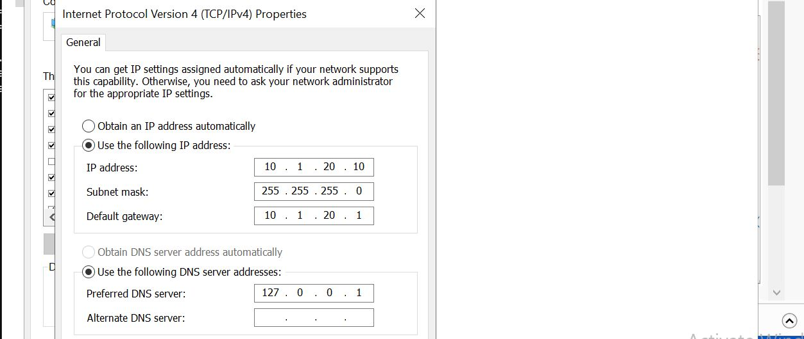

5. Click **OK** → **Close**

**Verify via PowerShell:**
```powershell
Get-NetIPConfiguration
```

Expected output should show `IPv4Address: 10.10.20.10` on the correct adapter.

---

### 5.2 Set the Hostname

The server must be renamed to `DC01` before promotion. Renaming after promotion requires additional steps.

**Via PowerShell (recommended):**
```powershell
Rename-Computer -NewName "DC01" -Restart
```

After the restart, log back in and verify:
```powershell
hostname
```
Expected output: `DC01`

---

### 5.3 Set the Time Zone

> Adjust the time zone name to match your region. Run `Get-TimeZone -ListAvailable` to find the exact string for your location.

Verify:
```powershell
Get-TimeZone
```

---

### 5.4 Apply Windows Updates

Before installing any roles, ensure the OS is fully patched:

1. Open **Settings → Windows Update**
2. Click **Check for Updates** and install all available updates
3. Restart if prompted
4. Repeat until no further updates are available

Alternatively via PowerShell:
```powershell
Install-Module PSWindowsUpdate -Force
Get-WindowsUpdate -Install -AcceptAll -AutoReboot
```

---

### 5.5 Verify Network Connectivity

From DC01, confirm network routing is correct before proceeding:

```powershell
# Ping the default gateway
ping 10.1.20.1
```
---

## 6. Phase 2 — Install AD DS and DNS Role

### 6.1 Install via Server Manager (GUI)

1. Open **Server Manager**
2. Click **Manage → Add Roles and Features**

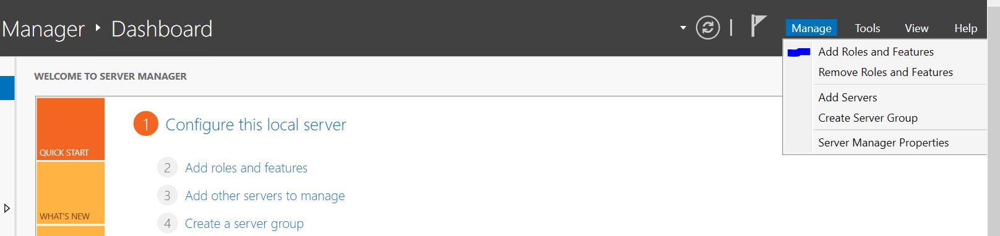

3. **Before You Begin** → click **Next**
4. **Installation Type** → select **Role-based or feature-based installation** → **Next**

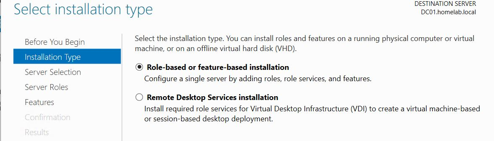

5. **Server Selection** → confirm `DC01` is selected → **Next**
6. **Server Roles** → check **Active Directory Domain Services and DNS**


> **Note:** Active Directory DS deployment requires DNS which could be deployed simultaneously. This is because DNS is integral to the functioning and management of an Active Directory environment. It provides name resolution services for domain-joined computers and services, enabling them to locate and communicate with domain controllers.

7. A pop-up appears — click **Add Features** to include required management tools
8. Click **Next** through Features and AD DS information pages
9. **Confirmation** → check **Restart the destination server automatically if required**

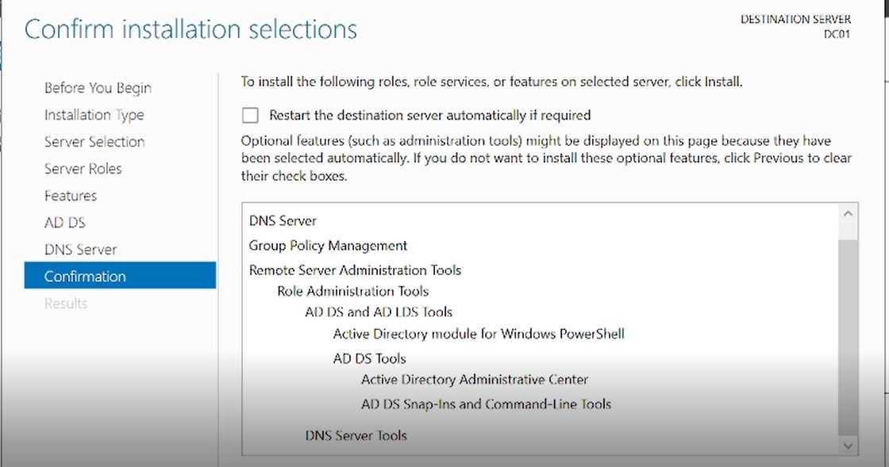

10. Click **Install**
11. Wait for installation to complete — do **not** close the window

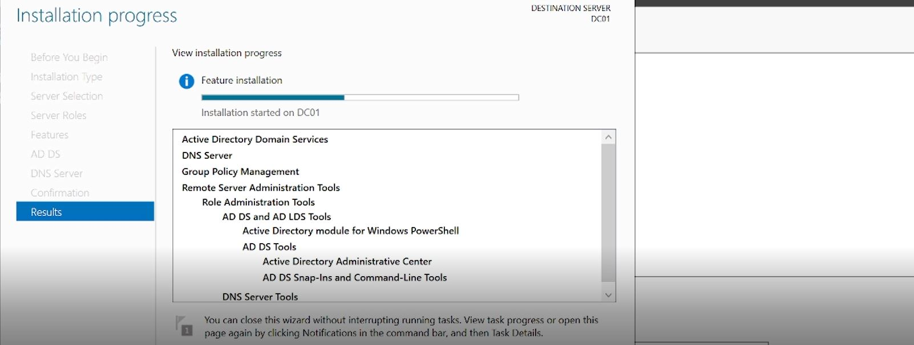

---

## 7. Phase 3 — Promote Server to Domain Controller

This phase creates a **new forest** and **new domain** (`homelab.local`), making DC01 the first and primary Domain Controller.

### 7.1 Launch the Promotion Wizard

1. In **Server Manager**, click the **notification flag** (yellow triangle) at the top
2. Click **Promote this server to a domain controller**

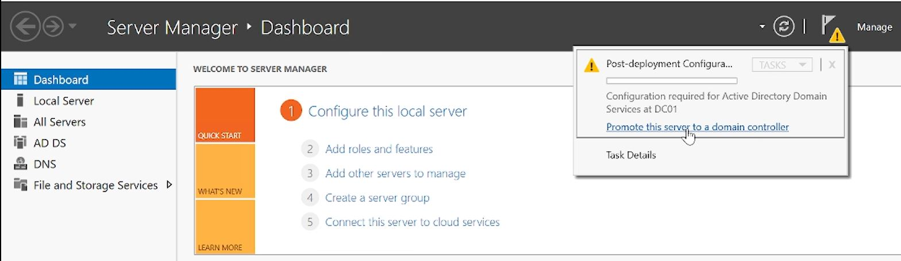

---

### 7.2 Deployment Configuration

1. Select **Add a new forest**
2. **Root domain name:** `homelab.local`
3. Click **Next**

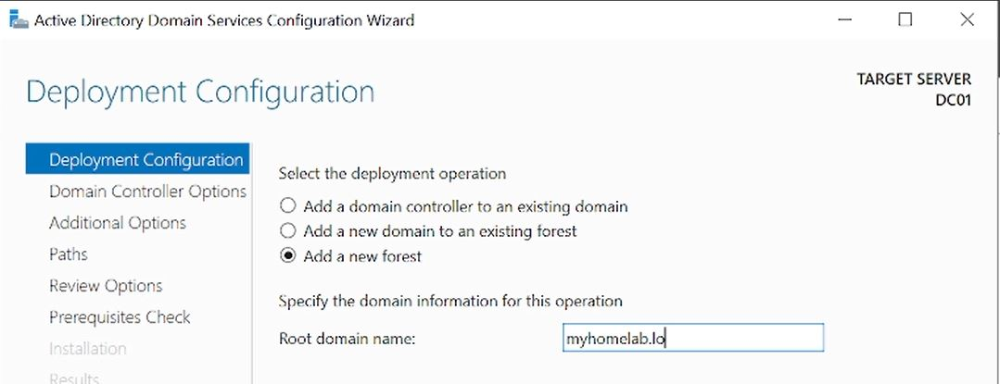

---

### 7.3 Domain Controller Options

| Setting | Value |
|---|---|
| Forest Functional Level | Windows Server 2016 |
| Domain Functional Level | Windows Server 2016 |
| Domain Name System (DNS) server | ✅ Checked |
| Global Catalog (GC) | ✅ Checked (greyed out — required for first DC) |
| Read Only Domain Controller (RODC) | ☐ Unchecked |
| DSRM Password | Set a strong password and record it securely |

> **DSRM (Directory Services Restore Mode) password** is critical — store it in a safe location. It is used to recover AD if the domain becomes unavailable.


Click **Next**

---

### 7.4 DNS Options

A warning may appear: *"A delegation for this DNS server cannot be created..."*

This is **expected and normal** in a new forest with no parent DNS zone. Click **Next** to continue.


---

### 7.5 Additional Options

**NetBIOS domain name** will auto-populate as `HOMELAB`. Confirm and click **Next**.


---

### 7.6 Paths (Default Locations)

Leave default paths unless you have a specific reason to change them:

| Path | Default Value |
|---|---|
| Database folder | `C:\Windows\NTDS` |
| Log files folder | `C:\Windows\NTDS` |
| SYSVOL folder | `C:\Windows\SYSVOL` |

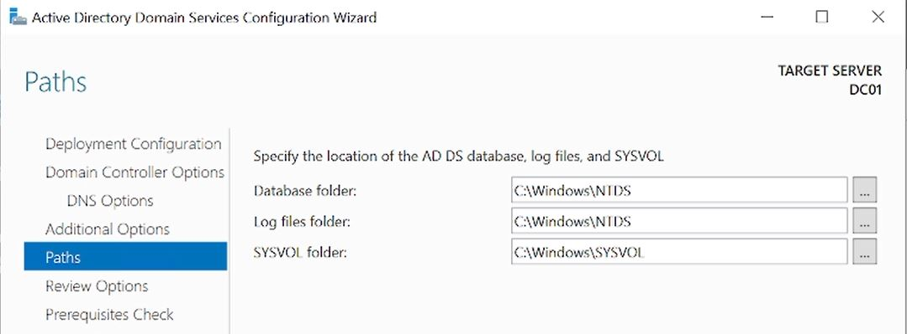

Click **Next**

---

### 7.7 Review Options

Review the summary. Optionally click **View Script** to export the equivalent PowerShell command for documentation purposes.


Click **Next**

---

### 7.8 Prerequisites Check

The wizard runs a prerequisites check. Common warnings you may see:

| Warning | Action |
|---|---|
| "Windows Server 2022 domain controllers have a default for..." | Informational — click Next |
| "This computer has at least one physical network adapter..." | Informational — click Next |
| Any **error** (red) | Must be resolved before proceeding |

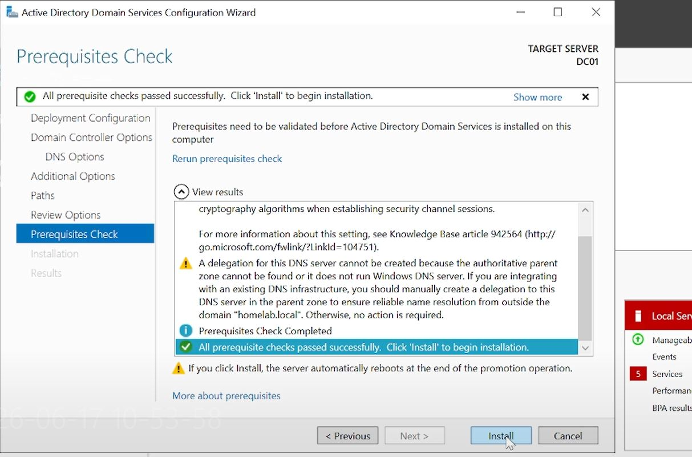

Once all checks show green or yellow warnings only, click **Install**

---

### 7.9 Post-Promotion Reboot

The server will **automatically restart** after promotion. After the reboot:

- Log in as `HOMELAB\Administrator` (domain account, not local)
- Server Manager will now show **AD DS** and **DNS** in the left panel
- The login screen will display `HOMELAB\Administrator`

---

### 7.10 Verify Promotion via PowerShell

```powershell
# Confirm domain information
Get-ADDomain

# Confirm forest information
Get-ADForest

# Confirm DC role
netdom query fsmo
```

Expected `Get-ADDomain` output includes:
```
DNSRoot           : homelab.local
DomainMode        : Windows2016Domain
Name              : homelab
NetBIOSName       : HOMELAB
```

---

## 8. Phase 4 — Post-Deployment Configuration

### 8.1 Verify DNS Configuration

After promotion, DC01 runs its own DNS server. Verify records were created correctly:

```powershell
# List all DNS zones
Get-DnsServerZone

# Confirm A record for DC01 exists
Resolve-DnsName -Name "DC01.homelab.local" -Type A

# Confirm SRV records exist (critical for AD functionality)
nslookup -type=SRV _ldap._tcp.homelab.local
```

Expected zones:
```
homelab.local           (Primary — Forward Lookup Zone)
10.10.10.in-addr.arpa   (Reverse Lookup Zone — if configured)
```

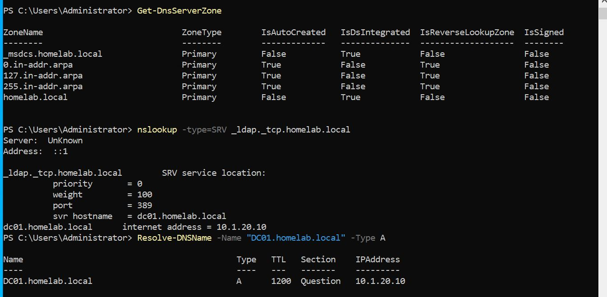

---

### 8.2 Create a Reverse Lookup Zone

A reverse lookup zone allows DNS to resolve IP addresses back to hostnames — important for monitoring and troubleshooting.

1. Open **DNS Manager** (Server Manager → Tools → DNS)
2. Expand `DC01` → right-click **Reverse Lookup Zones** → **New Zone**
3. Select **Primary Zone** → **Next**
4. Select **To all DNS servers running on domain controllers in this domain** → **Next**
5. Select **IPv4 Reverse Lookup Zone** → **Next**
6. **Network ID:** enter `10.1.10` → **Next**
7. Accept defaults → **Finish**

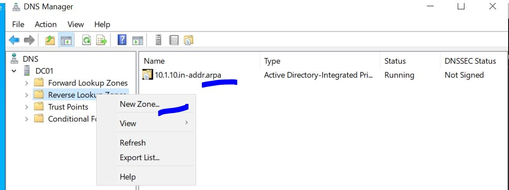

Add a PTR record for DC01:
```powershell
Add-DnsServerResourceRecordPtr -ZoneName "10.1.10.in-addr.arpa" `
  -Name "10" -PtrDomainName "DC01.homelab.local."
```

---

### 8.3 Configure NTP (Network Time Protocol)

DC01 must be the authoritative time source for the domain. Configure it to sync with an external NTP server:

```powershell
# Configure DC01 to sync with external NTP
w32tm /config /manualpeerlist:"pool.ntp.org" /syncfromflags:manual /reliable:YES /update

# Restart the Windows Time service
Restart-Service w32tm

# Force a sync
w32tm /resync /force

# Verify sync status
w32tm /query /status
```

---

### 8.4 Configure Password Policy (Default Domain Policy)

Open **Group Policy Management** (Server Manager → Tools → Group Policy Management):

1. Expand **Forest: homelab.local → Domains → homelab.local**
2. Right-click **Default Domain Policy** → **Edit**
3. Navigate to: `Computer Configuration → Policies → Windows Settings → Security Settings → Account Policies → Password Policy`
4. Configure:

| Setting | Recommended Value |
|---|---|
| Enforce password history | 10 passwords |
| Maximum password age | 90 days |
| Minimum password age | 1 day |
| Minimum password length | 12 characters |
| Password must meet complexity requirements | Enabled |
| Store passwords using reversible encryption | Disabled |


5. Navigate to **Account Lockout Policy**:

| Setting | Recommended Value |
|---|---|
| Account lockout duration | 30 minutes |
| Account lockout threshold | 5 invalid attempts |
| Reset account lockout counter after | 30 minutes |

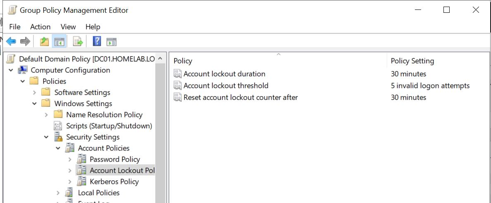

---

## 9. Phase 5 — Organisational Unit Structure

### 9.1 Design Rationale

A well-structured OU hierarchy enables granular Group Policy application, delegated administration, and logical resource organisation — mirroring real enterprise AD designs.

### 9.2 Planned OU Structure

```
homelab.local
├── _HOMELAB                          (Root OU — all managed objects)
│   ├── Users
│   │   ├── Admins                    (Privileged accounts)
│   │   ├── IT                        (IT department users)
│   │   └── Standard                  (Regular users)
│   ├── Groups
│   │   ├── Security                  (Security groups)
│   │   └── Distribution              (Distribution groups)
│   ├── Computers
│   │   ├── Workstations              (End-user machines)
│   │   ├── Servers                   (Member servers)
│   │   └── Domain Controllers        (DCs — typically managed separately)
│   └── Service Accounts              (Application/service accounts)
```

---

### 9.3 Create the OU Structure via PowerShell

```powershell
# Create root OU
New-ADOrganizationalUnit -Name "_HOMELAB" -Path "DC=homelab,DC=local" -ProtectedFromAccidentalDeletion $true

# Create sub-OUs under _HOMELAB
$root = "OU=_HOMELAB,DC=homelab,DC=local"

New-ADOrganizationalUnit -Name "Users"            -Path $root -ProtectedFromAccidentalDeletion $true
New-ADOrganizationalUnit -Name "Groups"           -Path $root -ProtectedFromAccidentalDeletion $true
New-ADOrganizationalUnit -Name "Computers"        -Path $root -ProtectedFromAccidentalDeletion $true
New-ADOrganizationalUnit -Name "Service Accounts" -Path $root -ProtectedFromAccidentalDeletion $true

# Create sub-OUs under Users
$usersOU = "OU=Users,$root"
New-ADOrganizationalUnit -Name "Admins"    -Path $usersOU -ProtectedFromAccidentalDeletion $true
New-ADOrganizationalUnit -Name "IT"        -Path $usersOU -ProtectedFromAccidentalDeletion $true
New-ADOrganizationalUnit -Name "Standard"  -Path $usersOU -ProtectedFromAccidentalDeletion $true

# Create sub-OUs under Groups
$groupsOU = "OU=Groups,$root"
New-ADOrganizationalUnit -Name "Security"      -Path $groupsOU -ProtectedFromAccidentalDeletion $true
New-ADOrganizationalUnit -Name "Distribution"  -Path $groupsOU -ProtectedFromAccidentalDeletion $true

# Create sub-OUs under Computers
$computersOU = "OU=Computers,$root"
New-ADOrganizationalUnit -Name "Workstations"        -Path $computersOU -ProtectedFromAccidentalDeletion $true
New-ADOrganizationalUnit -Name "Servers"             -Path $computersOU -ProtectedFromAccidentalDeletion $true
New-ADOrganizationalUnit -Name "Domain Controllers"  -Path $computersOU -ProtectedFromAccidentalDeletion $true
```

Verify the structure was created:
```powershell
Get-ADOrganizationalUnit -Filter * | Select-Object Name, DistinguishedName | Sort-Object DistinguishedName
```

---

## 10. Phase 6 — User and Group Management

### 10.1 Create Security Groups

```powershell
$securityOU = "OU=Security,OU=Groups,OU=_HOMELAB,DC=homelab,DC=local"

# Domain Admins equivalent (local)
New-ADGroup -Name "GRP-IT-Admins" `
  -GroupScope Global `
  -GroupCategory Security `
  -Path $securityOU `
  -Description "IT Administrators with elevated privileges"

# Standard IT users
New-ADGroup -Name "GRP-IT-Users" `
  -GroupScope Global `
  -GroupCategory Security `
  -Path $securityOU `
  -Description "IT Department standard users"

# Standard corporate users
New-ADGroup -Name "GRP-Standard-Users" `
  -GroupScope Global `
  -GroupCategory Security `
  -Path $securityOU `
  -Description "Standard domain users"

# Remote Desktop access group
New-ADGroup -Name "GRP-RDP-Access" `
  -GroupScope Global `
  -GroupCategory Security `
  -Path $securityOU `
  -Description "Users permitted to RDP to lab servers"
```

---

### 10.2 Create User Accounts

```powershell
$adminOU    = "OU=Admins,OU=Users,OU=_HOMELAB,DC=homelab,DC=local"
$itOU       = "OU=IT,OU=Users,OU=_HOMELAB,DC=homelab,DC=local"
$standardOU = "OU=Standard,OU=Users,OU=_HOMELAB,DC=homelab,DC=local"

# Admin account (your personal admin account)
New-ADUser `
  -Name "Leonard Noumba" `
  -GivenName "Leonard" `
  -Surname "Noumba" `
  -SamAccountName "l.noumba" `
  -UserPrincipalName "l.noumba@homelab.local" `
  -Path $adminOU `
  -AccountPassword (ConvertTo-SecureString "P@ssw0rd123!" -AsPlainText -Force) `
  -PasswordNeverExpires $false `
  -ChangePasswordAtLogon $true `
  -Enabled $true `
  -Description "IT Administrator" `
  -Department "IT" `
  -Title "IT Administrator"

# IT user example
New-ADUser `
  -Name "IT User01" `
  -GivenName "IT" `
  -Surname "User01" `
  -SamAccountName "it.user01" `
  -UserPrincipalName "it.user01@homelab.local" `
  -Path $itOU `
  -AccountPassword (ConvertTo-SecureString "P@ssw0rd123!" -AsPlainText -Force) `
  -PasswordNeverExpires $false `
  -ChangePasswordAtLogon $true `
  -Enabled $true `
  -Description "IT Department User" `
  -Department "IT"

# Standard user example
New-ADUser `
  -Name "Standard User01" `
  -GivenName "Standard" `
  -Surname "User01" `
  -SamAccountName "std.user01" `
  -UserPrincipalName "std.user01@homelab.local" `
  -Path $standardOU `
  -AccountPassword (ConvertTo-SecureString "P@ssw0rd123!" -AsPlainText -Force) `
  -PasswordNeverExpires $false `
  -ChangePasswordAtLogon $true `
  -Enabled $true `
  -Description "Standard Domain User" `
  -Department "Operations"
```

---

### 10.3 Add Users to Groups

```powershell
# Add l.noumba to IT Admins and Domain Admins
Add-ADGroupMember -Identity "GRP-IT-Admins"    -Members "l.noumba"
Add-ADGroupMember -Identity "Domain Admins"    -Members "l.noumba"
Add-ADGroupMember -Identity "GRP-RDP-Access"   -Members "l.noumba"

# Add IT user to IT group
Add-ADGroupMember -Identity "GRP-IT-Users"     -Members "it.user01"
Add-ADGroupMember -Identity "GRP-RDP-Access"   -Members "it.user01"

# Add standard user to standard group
Add-ADGroupMember -Identity "GRP-Standard-Users" -Members "std.user01"
```

Verify group membership:
```powershell
Get-ADGroupMember -Identity "GRP-IT-Admins" | Select-Object Name, SamAccountName
```

---

## 11. Phase 7 — Group Policy Objects

### 11.1 Overview

Group Policy Objects (GPOs) enforce security baselines and configuration standards across all domain-joined machines. The following GPOs will be created and linked to specific OUs.

| GPO Name | Linked To | Purpose |
|---|---|---|
| GPO-Baseline-Security | `OU=_HOMELAB` | Apply security settings to all objects |
| GPO-Workstation-Config | `OU=Workstations` | Workstation-specific settings |
| GPO-Server-Config | `OU=Servers` | Server hardening settings |

---

### 11.2 Create GPO — Baseline Security

```powershell
# Create the GPO
New-GPO -Name "GPO-Baseline-Security" -Comment "Baseline security settings for all homelab objects"

# Link it to the _HOMELAB root OU
New-GPLink -Name "GPO-Baseline-Security" -Target "OU=_HOMELAB,DC=homelab,DC=local"
```

**Configure settings via Group Policy Management Editor:**

1. Open **Group Policy Management** → expand to `OU=_HOMELAB`
2. Right-click **GPO-Baseline-Security** → **Edit**
3. Apply the following settings:

**Disable Guest Account:**
```
Computer Configuration → Policies → Windows Settings →
Security Settings → Local Policies → Security Options →
Accounts: Guest account status → Disabled
```

**Rename Administrator Account:**
```
Computer Configuration → Policies → Windows Settings →
Security Settings → Local Policies → Security Options →
Accounts: Rename administrator account → hlabadmin
```

**Interactive Logon Warning Banner:**
```
Computer Configuration → Policies → Windows Settings →
Security Settings → Local Policies → Security Options →
Interactive logon: Message title for users attempting to log on → "HOMELAB — Authorised Access Only"
Interactive logon: Message text → "This system is for authorised users only. All activity is monitored."
```

**Disable USB Storage (Lab hardening example):**
```
Computer Configuration → Policies → Administrative Templates →
System → Removable Storage Access →
All Removable Storage classes: Deny all access → Enabled
```

---

### 11.3 Create GPO — Workstation Configuration

```powershell
New-GPO -Name "GPO-Workstation-Config" -Comment "Workstation configuration and restrictions"
New-GPLink -Name "GPO-Workstation-Config" -Target "OU=Workstations,OU=Computers,OU=_HOMELAB,DC=homelab,DC=local"
```

**Configure screen lock via GPO Editor:**
```
Computer Configuration → Policies → Windows Settings →
Security Settings → Local Policies → Security Options →
Interactive logon: Machine inactivity limit → 600 seconds (10 minutes)
```

---

### 11.4 Force GPO Update

After configuring GPOs, force an immediate update on DC01:

```powershell
# Force GPO update locally
gpupdate /force

# Force GPO update on all domain computers (runs remotely)
Invoke-GPUpdate -Computer "DC01" -Force
```

Verify GPO application:
```powershell
gpresult /r
```

---

## 12. Phase 8 — DNS Verification

DNS is the foundation of Active Directory. All core AD functions depend on correct DNS resolution. Run the following verification checks:

```powershell
# Confirm forward lookup — DC01 hostname resolves correctly
Resolve-DnsName -Name "DC01.homelab.local" -Type A

# Confirm reverse lookup — IP resolves back to hostname
Resolve-DnsName -Name "10.10.10.10" -Type PTR

# Confirm SRV records — critical for domain join and authentication
nslookup -type=SRV _ldap._tcp.homelab.local
nslookup -type=SRV _kerberos._tcp.homelab.local

# Run built-in AD diagnostic tool
dcdiag /test:DNS /v
```

**Expected `dcdiag` result:**
```
......................... DC01 passed test DNS
```

If any test fails, refer to [Section 16 — Troubleshooting](#16-troubleshooting-reference).

---

## 13. Phase 9 — Join a Workstation to the Domain

### 13.1 Prepare the Workstation

On the workstation (e.g. a VM on VLAN50 LAB or your local PC):

1. Set **DNS** to point to DC01: `10.10.10.10`
2. Confirm the workstation can ping DC01: `ping 10.10.10.10`
3. Confirm DNS resolution: `nslookup homelab.local`

> If the workstation is on a different VLAN, ensure pfSense has a firewall rule allowing TCP/UDP 53 (DNS), TCP/UDP 88 (Kerberos), TCP/UDP 389 (LDAP), TCP 445 (SMB), TCP 3268 (Global Catalog) from that VLAN to VLAN10.

---

### 13.2 Join the Domain

**Via GUI:**
1. Right-click **This PC** → **Properties**
2. Click **Change settings** (next to computer name)
3. Click **Change**
4. Select **Domain** → enter `homelab.local`
5. Enter credentials: `HOMELAB\Administrator` (or `l.noumba`)
6. Click **OK** — a welcome message confirms success
7. Restart the workstation

**Via PowerShell:**
```powershell
Add-Computer -DomainName "homelab.local" `
  -Credential (Get-Credential) `
  -OUPath "OU=Workstations,OU=Computers,OU=_HOMELAB,DC=homelab,DC=local" `
  -Restart
```

> The `-OUPath` parameter places the computer object directly into the correct OU rather than the default `Computers` container.

---

### 13.3 Verify on DC01

After the workstation restarts, verify on DC01:

```powershell
# Confirm computer object appeared in AD
Get-ADComputer -Filter * | Select-Object Name, DistinguishedName

# Confirm it landed in the correct OU
Get-ADComputer -Identity "WORKSTATION01" -Properties DistinguishedName | Select-Object DistinguishedName
```

---

## 14. Verification & Testing

| Test | Command / Method | Expected Result |
|---|---|---|
| DC01 hostname resolves | `Resolve-DnsName DC01.homelab.local` | Returns `10.10.10.10` |
| Reverse lookup | `Resolve-DnsName 10.10.10.10` | Returns `DC01.homelab.local` |
| LDAP SRV record | `nslookup -type=SRV _ldap._tcp.homelab.local` | Returns DC01 record |
| AD DS health | `dcdiag /v` | All tests pass |
| Replication health | `repadmin /replsummary` | No errors |
| FSMO roles | `netdom query fsmo` | All 5 roles on DC01 |
| OU structure | `Get-ADOrganizationalUnit -Filter *` | All OUs visible |
| User accounts | `Get-ADUser -Filter *` | All users visible |
| Group membership | `Get-ADGroupMember "GRP-IT-Admins"` | Members listed correctly |
| GPO application | `gpresult /r` | GPOs listed as applied |
| Domain join | Login as `HOMELAB\l.noumba` on workstation | Successful login |
| Password policy | Attempt weak password change | Rejected by policy |

---

## 15. Lessons Learned

### 15.1 Technical

- **Rename the server before promoting to DC.** Renaming a Domain Controller after promotion requires additional steps (metadata cleanup, DNS updates) and risks breaking AD replication. Always set the hostname first.
- **Set DNS to loopback (127.0.0.1) before promotion.** If DC01 points to an external DNS server during promotion, the wizard may fail to create the forward lookup zone correctly.
- **ProtectedFromAccidentalDeletion should be enabled on all OUs.** This prevents accidental OU deletion from cascading into mass object deletion — a common and destructive mistake in lab and production environments.
- **The DSRM password is not the same as the Administrator password.** It must be stored separately and securely — losing it means you cannot perform offline AD recovery.
- **CGNAT and multi-VLAN environments require additional firewall rules for domain join.** Workstations on different VLANs must be allowed to reach DC01 on ports 53, 88, 135, 389, 445, 464, 636, 3268 through pfSense.
- **GPO changes require `gpupdate /force` to take effect immediately.** Without it, changes are applied only at the next policy refresh interval (every 90 minutes by default).

### 15.2 Process

- **Use PowerShell for repeatable provisioning.** GUI-based steps are difficult to reproduce consistently. All user, group, and OU creation tasks are scripted in this document to enable re-deployment in minutes.
- **Verify DNS at every phase, not just at the end.** DNS failures cascade into authentication failures, GPO failures, and domain join failures. Testing DNS after promotion (Phase 8) saves significant troubleshooting time.
- **Place computers into the correct OU at join time using `-OUPath`.** Computer objects placed in the default `Computers` container do not receive GPOs linked to custom OUs.

### 15.3 Recommendations for Future Iterations

- Deploy a **secondary Domain Controller (DC02)** on VLAN20 (INFRA) for redundancy and to demonstrate AD replication concepts.
- Implement **fine-grained password policies (PSOs)** to apply stricter password rules to admin accounts while keeping standard policies for regular users.
- Integrate **SolarWinds** monitoring to alert on DC health, replication latency, and LDAP query response times — directly applicable to existing SolarWinds lab and client deployments.
- Explore **AD Sites and Services** configuration to simulate a multi-site enterprise environment across VLANs.

---

## 16. Troubleshooting Reference

| Symptom | Likely Cause | Resolution |
|---|---|---|
| Promotion fails — DNS error | DNS not set to loopback | Set DNS to `127.0.0.1` before promotion |
| Workstation cannot find domain | Wrong DNS on workstation | Set DNS to `10.10.10.10` (DC01) |
| Domain join fails — credentials rejected | Wrong format | Use `HOMELAB\Administrator` not just `Administrator` |
| GPOs not applying | Policy not refreshed | Run `gpupdate /force` on target machine |
| `dcdiag` fails DNS test | Missing SRV records | Run `netlogon` service restart: `Restart-Service netlogon` |
| `repadmin` shows errors | Single DC — no replication partner | Normal for single-DC lab — deploy DC02 to resolve |
| Computer lands in wrong OU | OUPath not specified at join | Move via `Move-ADObject` or re-join with correct OUPath |
| User cannot log in on workstation | Account disabled or locked | Check via `Get-ADUser -Identity username -Properties LockedOut, Enabled` |
| Clock skew error during login | Time not synced | Run `w32tm /resync /force` on DC01 and workstation |

---

## References

- Microsoft Documentation — Active Directory Domain Services: https://docs.microsoft.com/en-us/windows-server/identity/ad-ds/
- Microsoft Documentation — Group Policy: https://docs.microsoft.com/en-us/previous-versions/windows/it-pro/windows-server-2012-r2-and-2012/
- HL-NET-001 — Home Lab Network Design
- HL-NET-002 v2.0 — VLAN Architecture and pfSense Configuration
- HL-NET-003 — Remote Access: WireGuard and Tailscale Implementation
